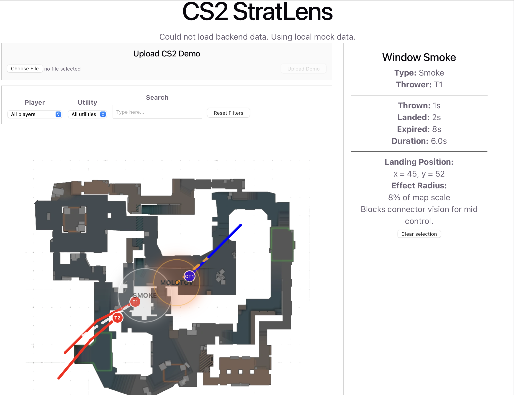

# CS2 StratLens

CS2 StratLens is a full-stack web app for visualizing Counter-Strike 2 replay data, player movement, and utility events on a top-down Mirage map.

The project is built as a replay analysis prototype. It currently uses structured mock round data, but the backend is designed so that parsed CS2 demo data can later be converted into the same format and visualized by the frontend.

## Current Features

- Display a Mirage map with player movement paths
- Replay timeline with play, pause, reset, and scrub controls
- Smooth player movement using interpolation between time points
- Visualize utility lifecycle states:
  - waiting
  - flying
  - active
  - expired
- Show smoke, flash, and molotov effects on the map
- Draw utility throw lines from start position to landing position
- Search utilities by name, type, thrower, or description
- Filter by player and utility type
- Click utility events to view detailed timing and position information
- Upload `.dem` files through a React upload UI
- FastAPI backend serving replay data
- SQLite prototype for storing and retrieving utility events

## Screenshot



## Tech Stack

### Frontend

- React
- Vite
- JavaScript
- CSS

### Backend

- Python
- FastAPI
- SQLite
- Uvicorn

## Project Architecture

```text
React Frontend
  |
  | fetch("http://127.0.0.1:8000/round")
  v
FastAPI Backend
  |
  | reads structured round data
  v
Replay Data
  |
  | players + utilities
  v
Map Visualization
```

The frontend consumes normalized round data from the FastAPI backend. The round data contains player movement paths and utility event information. This design separates the visualization logic from the data source, so the mock data can later be replaced with parsed CS2 demo data.

## Backend API

```text
GET  /
GET  /health
GET  /round
GET  /players
GET  /utilities
POST /utilities
POST /upload-demo
```

## How to Run Locally

This project has two parts:

- React frontend
- FastAPI backend

You need to run both at the same time in two separate terminals.

### 1. Start the backend

Open a terminal and go to the backend folder:

```bash
cd backend
```

Create and activate a Python virtual environment:

```bash
python3 -m venv venv
source venv/bin/activate
```

Install backend dependencies:

```bash
pip install fastapi uvicorn python-multipart
```

Start the FastAPI server:

```bash
uvicorn main:app --reload
```

The backend will run at:

```text
http://127.0.0.1:8000
```

You can test the backend by opening:

```text
http://127.0.0.1:8000/health
```

FastAPI documentation is available at:

```text
http://127.0.0.1:8000/docs
```

### 2. Start the frontend

Open a second terminal and go to the project root folder.

Install frontend dependencies:

```bash
npm install
```

Start the React development server:

```bash
npm run dev
```

The frontend will run at:

```text
http://localhost:5173
```

## Local Development Notes

The frontend fetches replay data from the backend endpoint:

```text
http://127.0.0.1:8000/round
```

The backend must be running before the frontend can load backend round data.

The `.dem` upload feature sends files to:

```text
POST http://127.0.0.1:8000/upload-demo
```

Uploaded demo files are saved locally in:

```text
backend/uploads/
```

## Current Status

CS2 StratLens is currently a full-stack prototype. It can visualize structured mock CS2 round data, replay player movement, display smoke/flash/molotov utility events, search and filter utility events, upload demo files, and store utility records with SQLite.

## Next Steps

- Connect the frontend utility list directly to SQLite-backed data
- Add update and delete endpoints for utility records
- Improve UI layout and styling
- Add support for more maps
- Parse real CS2 `.dem` files and convert them into the current round data schema
- Deploy the frontend and backend